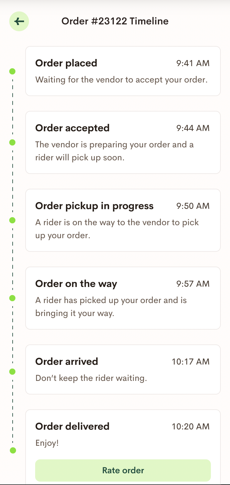

# Odaz - A flutter order tracking application

## Features

- [ ] Sign in with Google or Github using Firebase Auth
- [ ] Show User Profile on Sign In
- [ ] Show Sample Order
  - Order Details Section: OrderID, OrderDate, OrderItem, OrderQuantity, OrderPrice
  - Tracking Order Section: Shows current status of order. Has button labelled 'Track your order' that takes them to Tracking Detail Page
- [ ] Tracking Detail Page
  - Statuses:
    - ORDER PLACED
    - ORDER ACCEPTED
    - ORDER PICK UP IN PROGRESS
    - ORDER ON THE WAY TO CUSTOMER
    - ORDER ARRIVED
    - ORDER DELIVERED

## Samples

## Requirements

- Updates to be mocked from Ably
- Decent UI
- Reusable, maintainable code
- Fast, real-time, easy navigation
